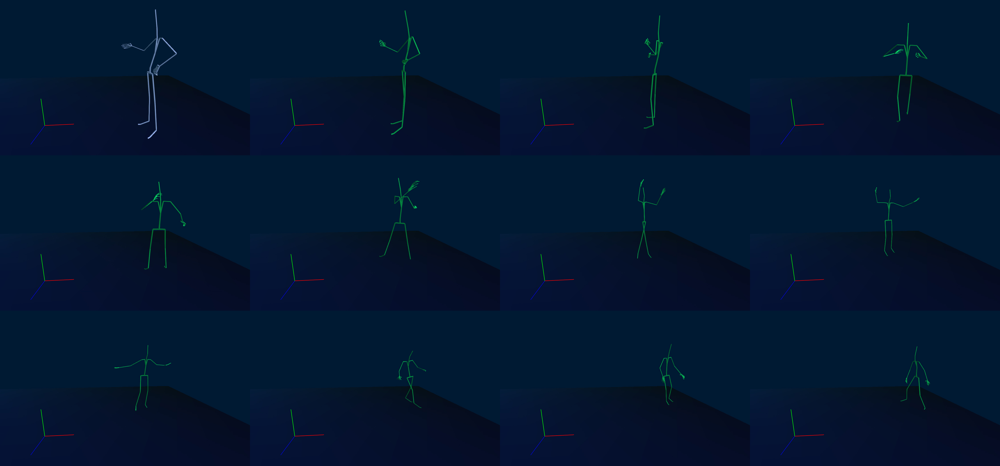

# MachineLearning

## CopperAnalysis
Using more traditional ML techniques for classifying the number of processing times of copper samples.

## MoCap
Experiments on using RNNs for modeling 3D motion capture data. Part of a Master's thesis. Figure below shows some frames generated by the RNN. 

## TheanoTests
Learning theano for ML implementations
